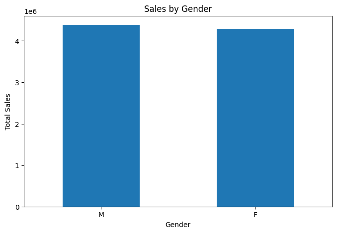
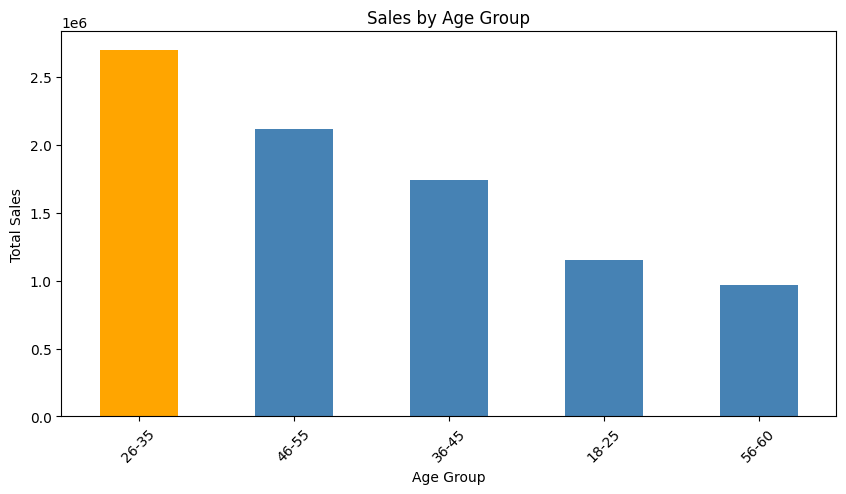
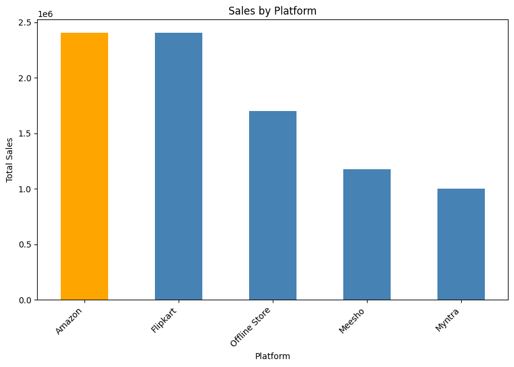
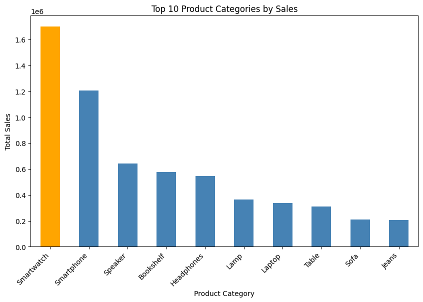
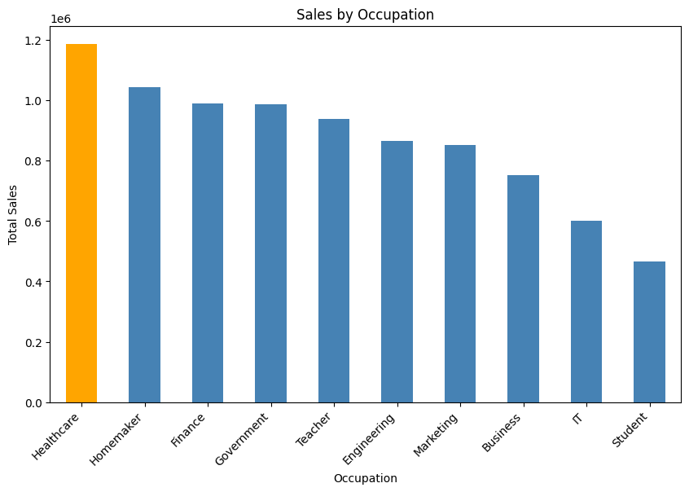
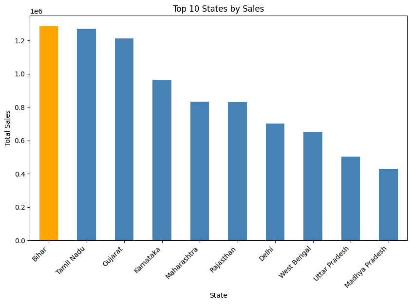
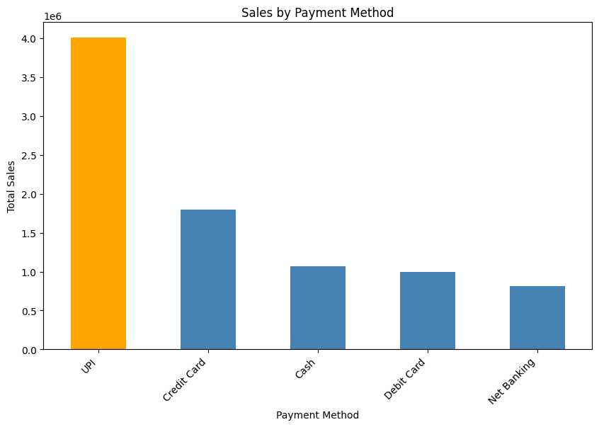

# 🪔 Diwali Sales Analysis

## 📌 Project Overview

This project analyzes Diwali sales data to understand customer purchasing behavior, sales patterns, and product performance.

The analysis was performed using Python and popular data analysis and visualization libraries. The project includes data cleaning, exploratory data analysis (EDA), data aggregation, visualization, and business insights.

## 🎯 Objectives

* Clean and prepare the sales dataset for analysis.
* Analyze customer demographics and purchasing behavior.
* Identify high-performing states, occupations, and product categories.
* Compare sales performance across different platforms.
* Analyze customer payment preferences.
* Extract meaningful business insights from the data.

## 🛠️ Technologies Used

* Python
* Pandas
* NumPy
* Matplotlib
* Seaborn
* Jupyter Notebook

## 📂 Project Structure

```text
Diwali-Sales-Analysis/
│
├── dataset/
│   └── diwali_sales_500_rows.csv
│
├── images/
│   ├── age_group_sales.png
│   ├── payment_sales.png
│   ├── platform_sales.png
│   ├── sales_by_gender.png
│   ├── top_categories.png
│   ├── top_occupations.png
│   └── top_states.png
│
├── notebooks/
│   └── Diwali_Sales_Analysis.ipynb
│
├── README.md
└── requirements.txt
```

## 🔍 Analysis Performed

The project includes the following analyses:

1. Gender-wise Sales Analysis
2. Age Group-wise Sales Analysis
3. State-wise Sales Analysis
4. Occupation-wise Sales Analysis
5. Product Category-wise Sales Analysis
6. Platform-wise Sales Analysis
7. Payment Method-wise Sales Analysis

## 📊 Key Business Insights

* Customers aged **26–35** generated the highest total sales among the analyzed age groups.
* **Bihar** generated the highest total sales among the analyzed states.
* **Healthcare** was the highest-selling occupation segment.
* **Smartwatch** generated the highest sales among the analyzed product categories.
* **Amazon** generated the highest sales among the analyzed platforms, closely followed by Flipkart.
* **UPI** was the highest-selling payment method by total sales.

## 📈 Visualizations

### Sales by Gender



### Sales by Age Group



### Sales by Platform



### Top Categories



### Top Occupations



### Top States



### Payment Sales



## ▶️ How to Run

### 1. Clone the repository

```bash
git clone https://github.com/deepak-kumar-sah/Diwali-Sales-Analysis.git
```

### 2. Navigate to the project folder

```bash
cd Diwali-Sales-Analysis
```

### 3. Install the required libraries

```bash
pip install -r requirements.txt
```

### 4. Open the Jupyter Notebook

Open:

```text
notebooks/Diwali_Sales_Analysis.ipynb
```

Run the notebook cells to reproduce the analysis.

## 💡 Skills Demonstrated

* Data Cleaning
* Exploratory Data Analysis
* Data Aggregation
* GroupBy Analysis
* Data Visualization
* Business Insights
* Python Data Analysis
* Pandas
* NumPy
* Matplotlib
* Seaborn

## 👨‍💻 Author

**Deepak Kumar Sah**

B.Tech Computer Science Engineering

Interested in Data Analytics and Data Science.
